# Relatório Técnico: Introdução à Virtualização e Instalação do Ubuntu Server 26.04

## 1. Identificação

- **Nome completo:** Mateus Alves dos Santos
- **Curso:** Sistemas de Informação
- **Turma:** BAC.0062 - LABORATÓRIO DE SISTEMAS OPERACIONAIS DE REDES
- **Data:** 12/08/2026
- **Título da prática:** Aula Prática 01: Introdução à Virtualização e Instalação do Ubuntu Server 26.04

---

## 2. Objetivo

A atividade teve como objetivo compreender os conceitos fundamentais de virtualização por meio da criação e configuração de uma máquina virtual utilizando o Oracle VM VirtualBox.

A prática também teve como finalidade realizar a instalação do Ubuntu Server 26.04, incluindo a configuração do armazenamento utilizando LVM, definição da rede, criação de um perfil administrativo e instalação do OpenSSH Server.

Ao final do procedimento, foram realizados testes de validação para verificar a configuração de rede, o armazenamento e a atualização dos repositórios do sistema.

---

## 3. Ambiente

### 3.1. Virtualizador

O ambiente virtual foi criado utilizando o **Oracle VM VirtualBox**.

### 3.2. Configuração da máquina virtual

A máquina virtual foi criada com as seguintes configurações observadas durante a preparação:

| Configuração | Valor |
|---|---|
| **Nome da VM** | `ubuntu_server` |
| **Sistema operacional** | Ubuntu |
| **Versão** | Ubuntu 64-bit |
| **Memória RAM** | 2048 MB |
| **Processador** | 1 CPU |
| **Disco virtual** | 32 GB |
| **Formato do disco** | VDI |
| **Alocação do disco** | Dinamicamente alocado |
| **Imagem ISO** | `ubuntu-26.04-live-server-amd64.iso` |

### Evidência — Nome, sistema operacional e ISO

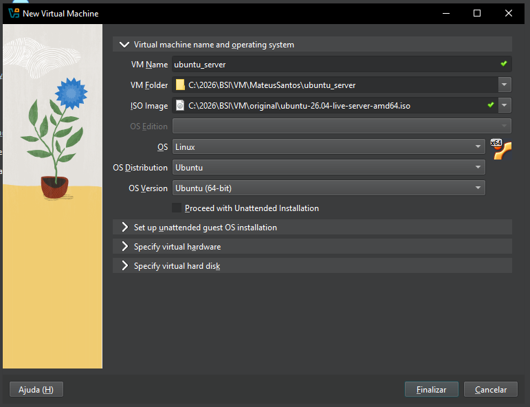

### Evidência — Memória e processador

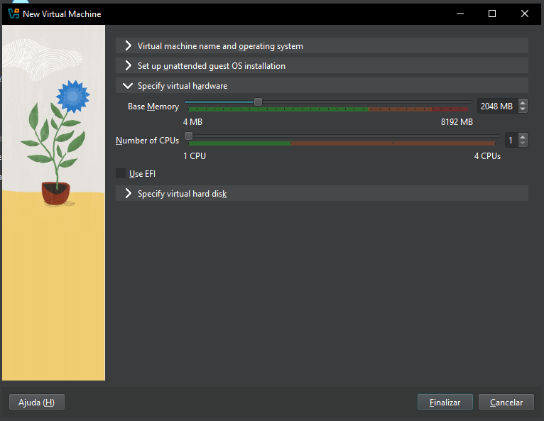

### Evidência — Disco virtual

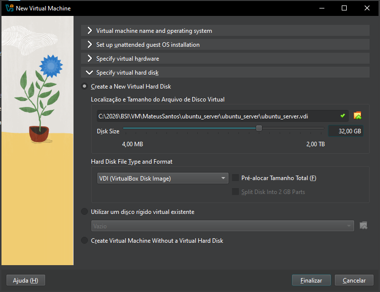

### Evidência — Máquina virtual criada

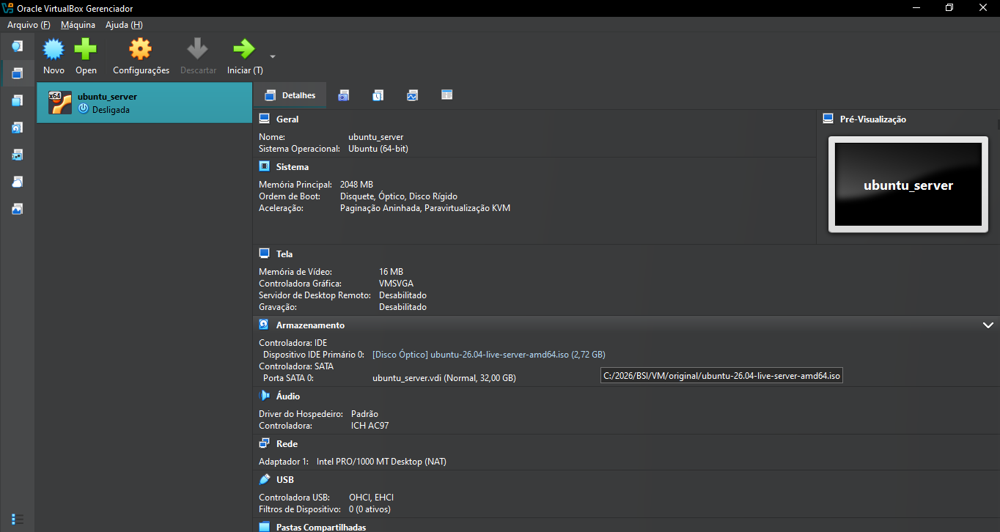

---

## 4. Procedimento

### 4.1. Criação da máquina virtual

Inicialmente, foi criada uma nova máquina virtual no Oracle VM VirtualBox com o nome `ubuntu_server`.

Durante a criação foram definidos o sistema operacional Ubuntu 64-bit, a quantidade de memória e processadores e o disco virtual de 32 GB.

A imagem ISO do Ubuntu Server 26.04 foi selecionada como mídia de instalação.

As três telas abaixo registram as principais configurações realizadas durante a criação da VM.


---

### 4.2. Inicialização da instalação

Após a criação da máquina virtual, a VM foi inicializada utilizando a imagem ISO do Ubuntu Server.

A primeira tela apresentada foi o menu de inicialização do instalador, com a opção **Try or Install Ubuntu Server**.

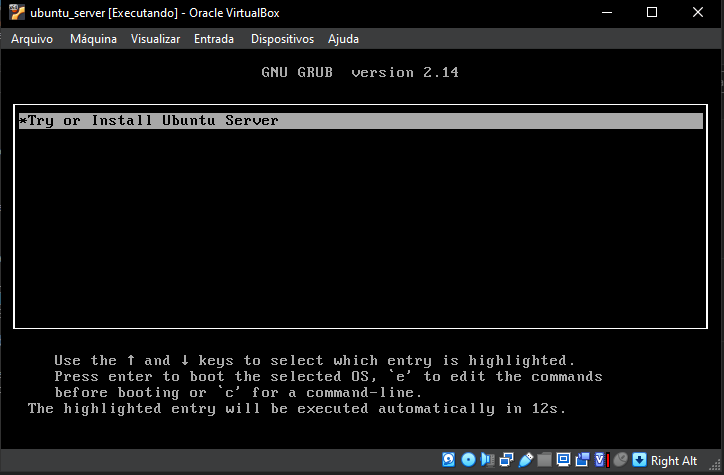

---

### 4.3. Seleção do idioma

No instalador, foi selecionado o idioma **English** para a interface do processo de instalação.

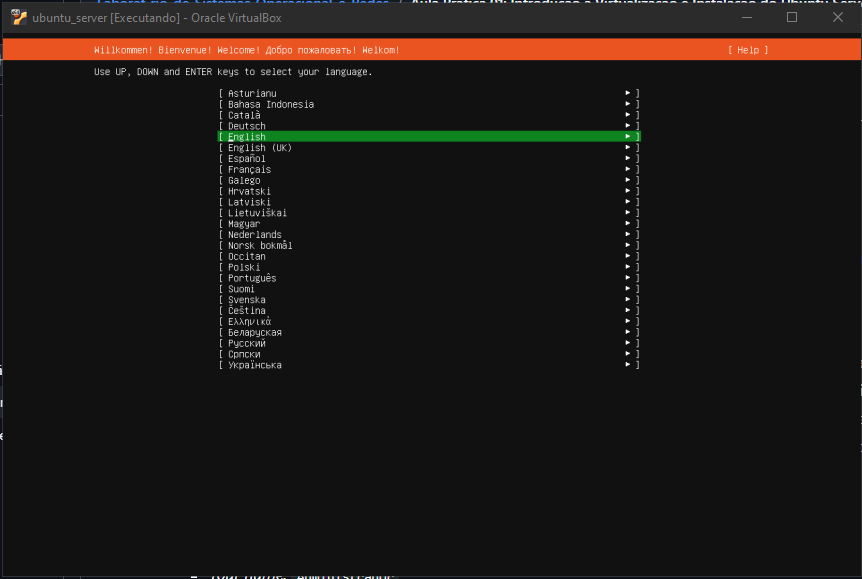

---

### 4.4. Configuração do teclado

Em seguida, foi realizada a configuração do teclado.

Foi utilizado o layout **Portuguese (Brazil)**, conforme registrado na tela do instalador.

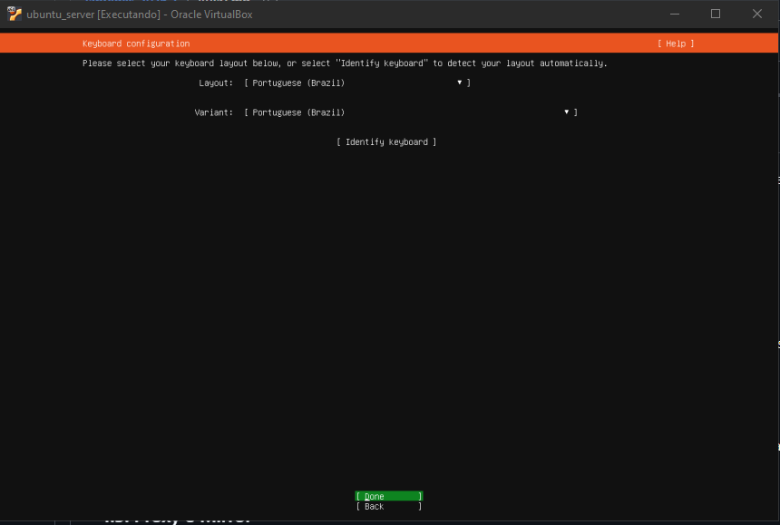

---

### 4.5. Seleção do tipo de instalação

Na etapa de escolha do tipo de instalação, foi selecionada a opção **Ubuntu Server**.

Também foi apresentada a possibilidade de utilização da versão minimizada e da instalação de drivers de terceiros.

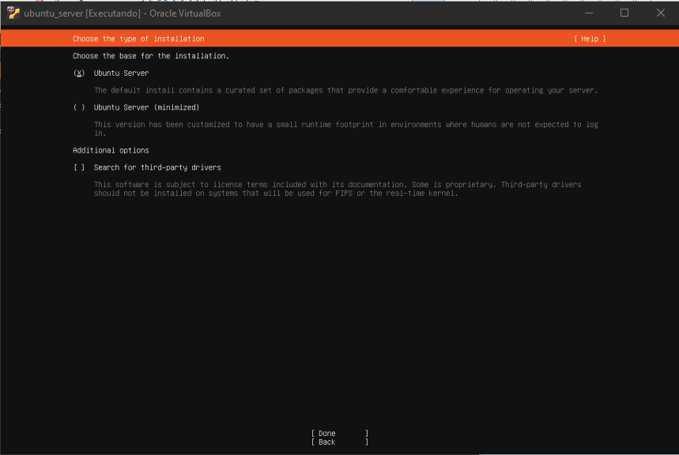

---

### 4.6. Configuração da rede

O instalador identificou a interface de rede `enp0s3`.

A interface recebeu configuração automática por DHCP, permitindo que o servidor obtivesse conectividade de rede durante o processo de instalação.

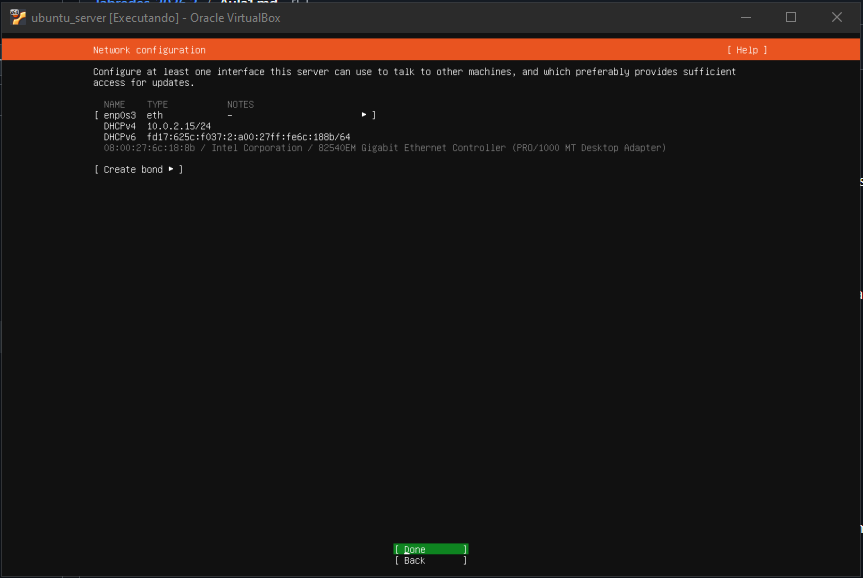

---

### 4.7. Configuração do mirror de pacotes

Na etapa de configuração do Ubuntu Archive Mirror, foi utilizado o endereço padrão:

```text
http://br.archive.ubuntu.com/ubuntu
```

O instalador realizou os testes de acesso ao mirror e iniciou a leitura das listas de pacotes.

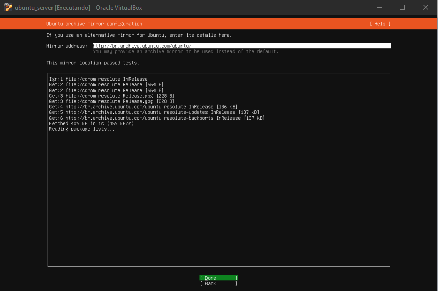

---

## 5. Configuração do armazenamento

### 5.1. Seleção do layout personalizado

Para atender à proposta da atividade, foi utilizado o **Custom storage layout**, permitindo realizar manualmente a configuração das partições e volumes.

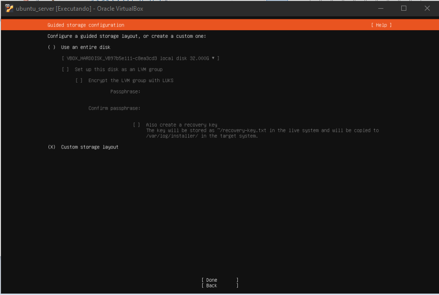

---

### 5.2. Seleção do disco

O disco virtual disponível foi identificado pelo instalador com aproximadamente **32 GB** de capacidade.

Nesse momento ainda não havia partições ou volumes configurados.

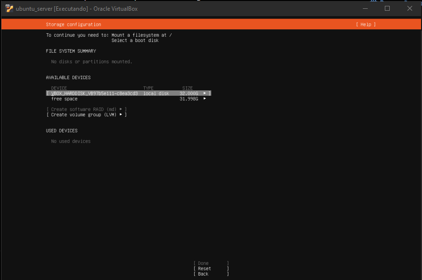

---

### 5.3. Criação da partição `/boot`

Foi criada uma partição de **1024 MB (1 GB)**, formatada em `ext4` e configurada com o ponto de montagem:

```text
/boot
```

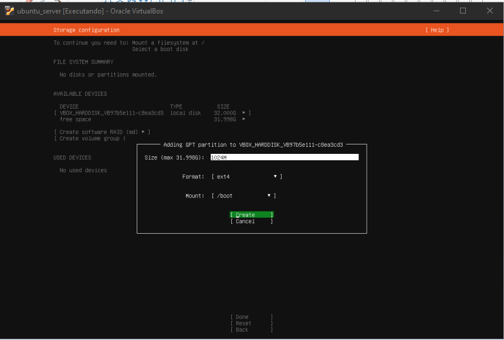

---

### 5.4. Estrutura final do armazenamento

Após a configuração do armazenamento, o instalador apresentou a estrutura final com:

| Ponto de montagem | Tamanho aproximado | Tipo |
|---|---:|---|
| `/` | 29 GB | ext4 |
| `/boot` | 1 GB | ext4 |
| `SWAP` | 2 GB | swap |

Também foi criado o grupo de volumes LVM:

```text
ubuntu-vg
```

com os volumes lógicos:

```text
ubuntu-lv
swap-lv
```

O volume `ubuntu-lv` foi destinado ao sistema de arquivos raiz `/`, enquanto `swap-lv` foi destinado à área de swap.

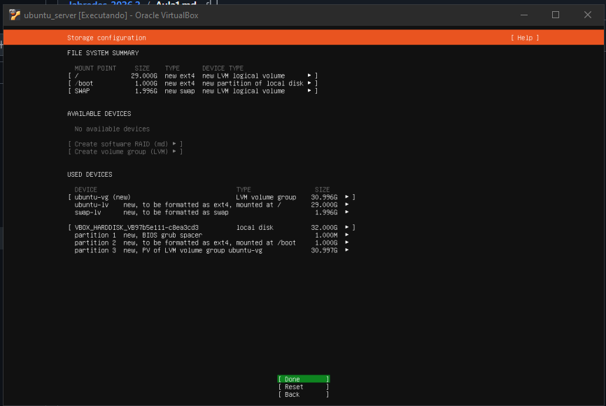

---

## 6. Configuração do usuário administrador

Durante a etapa **Profile configuration**, foi criado o perfil administrativo utilizado para acessar o sistema.

Foram definidos:

- **Nome:** `Administrador`
- **Nome do servidor:** `ubuntu_server`
- **Nome de usuário:** `administrador`

A senha foi definida durante a instalação e não é reproduzida neste relatório por questões de segurança.

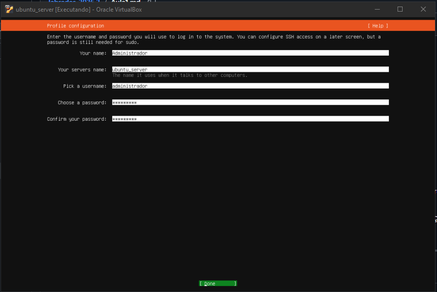

---

## 7. Configuração do OpenSSH Server

Na etapa de configuração do SSH, foi selecionada a opção de instalação do **OpenSSH Server**.

A instalação desse serviço prepara o Ubuntu Server para permitir acesso remoto seguro por meio do protocolo SSH.

Também foi mantida habilitada a autenticação por senha apresentada pelo instalador.

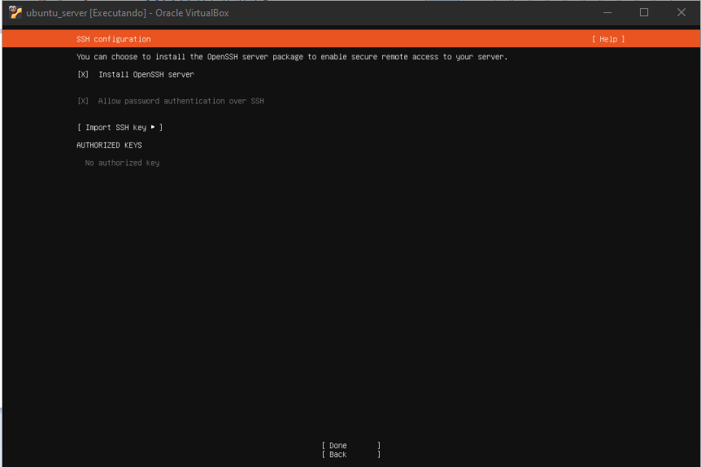

---

## 8. Primeiro acesso e validação do sistema

Após a conclusão da instalação, o sistema foi iniciado e foram realizados testes para verificar o funcionamento do ambiente.

---

### 8.1. Atualização dos repositórios

Foi executado o comando:

```bash
sudo apt-get update
```

O comando atualiza as informações sobre os pacotes disponíveis nos repositórios configurados.

A saída apresentada demonstra que o sistema conseguiu consultar os repositórios e atualizar as informações de pacotes.

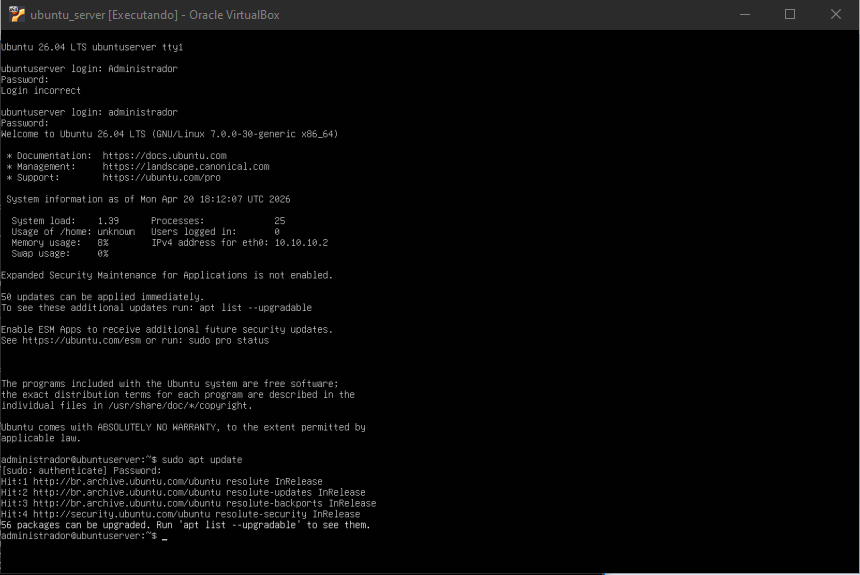

---

### 8.2. Verificação das interfaces e endereços IP

Para verificar a configuração de rede, foi utilizado:

```bash
ip addr
```

O comando permitiu visualizar as interfaces de rede disponíveis e os endereços IP associados à máquina virtual.

Entre as informações apresentadas está a interface `enp0s3`, utilizada durante a instalação.

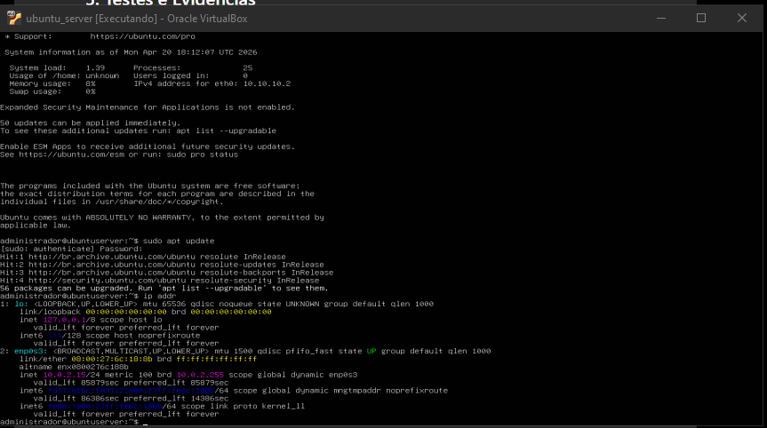

---

### 8.3. Verificação do armazenamento

Para verificar os sistemas de arquivos e o espaço disponível, foi utilizado:

```bash
df -h
```

O resultado permitiu visualizar os sistemas de arquivos montados e suas respectivas capacidades e utilização.

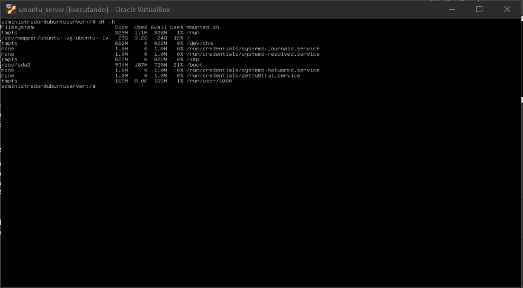

---

## 9. Evidências da atividade

As evidências desta prática estão organizadas na pasta:

```text
Aula01/Evidências/
```

Os arquivos foram nomeados de acordo com a etapa correspondente, facilitando a identificação e a consulta de cada procedimento.

---

## 10. Problemas e soluções

### 10.1. Observação sobre a configuração de memória

A máquina virtual utilizada na atividade foi configurada com **2048 MB de memória RAM**, conforme apresentado na evidência de configuração da VM.


> Caso tenha ocorrido algum problema específico durante a instalação, ele pode ser descrito nesta seção juntamente com a causa e a solução utilizada.

---

## 11. Resultados

Ao final da atividade, foi obtido um ambiente virtual funcional executando o Ubuntu Server 26.04.

Foram realizadas as seguintes etapas:

- criação da máquina virtual no VirtualBox;
- configuração de memória, CPU e armazenamento;
- utilização da imagem ISO do Ubuntu Server 26.04;
- inicialização do instalador;
- configuração do idioma e teclado;
- configuração da rede;
- configuração do mirror de pacotes;
- criação do layout personalizado de armazenamento;
- criação da partição `/boot`;
- criação do grupo de volumes LVM `ubuntu-vg`;
- criação dos volumes `ubuntu-lv` e `swap-lv`;
- configuração do sistema de arquivos raiz;
- configuração da área de SWAP;
- criação do usuário administrativo;
- instalação do OpenSSH Server;
- atualização dos repositórios;
- verificação da configuração de rede;
- verificação do armazenamento.

---

## 12. Conclusão

A prática permitiu compreender, de forma prática, o processo de criação e configuração de uma máquina virtual e a instalação de um sistema operacional destinado à função de servidor.

A utilização do Oracle VM VirtualBox possibilitou trabalhar com conceitos de virtualização e recursos de hardware virtual, enquanto a instalação do Ubuntu Server permitiu praticar configurações importantes de um ambiente Linux.

A configuração personalizada do armazenamento proporcionou contato com o gerenciamento de partições e volumes utilizando LVM, incluindo a criação do volume raiz e da área de SWAP.

Também foram praticadas configurações relacionadas à rede, criação do usuário administrativo e instalação do OpenSSH Server. Por fim, os comandos `sudo apt-get update`, `ip addr` e `df -h` foram utilizados para validar o funcionamento do sistema instalado.

Dessa forma, o ambiente foi preparado para as próximas atividades práticas da disciplina de Laboratório de Sistemas Operacionais e Redes.

