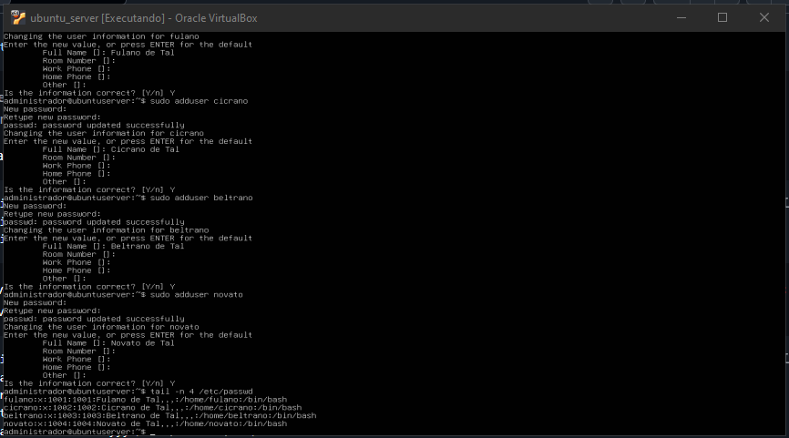
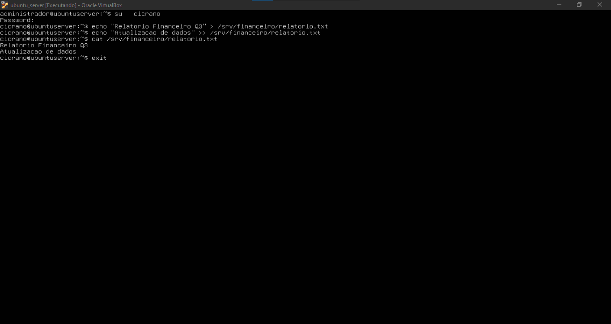
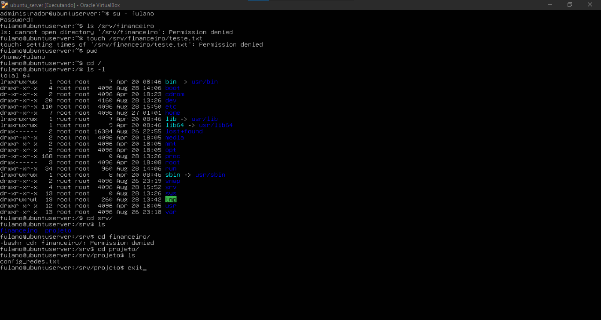
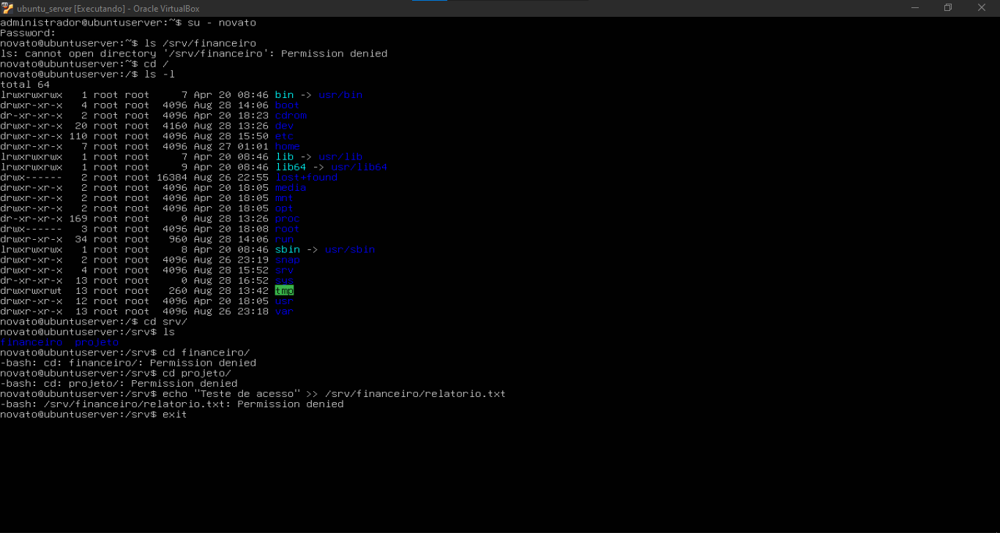

# Relatório Técnico: Administração de Usuários, Grupos e Permissões no Linux

## 1. Identificação

- **Nome completo:** Mateus Alves dos Santos
- **Curso:** Sistemas de Informação
- **Data:** 28/08/2026
- **Título da prática:** Aula Prática 02: Administração de Usuários, Grupos e Permissões no Linux

---

## 2. Objetivo

A atividade teve como objetivo praticar a administração de usuários, grupos, arquivos e diretórios no Ubuntu Server, compreendendo como as permissões POSIX controlam o acesso aos recursos do sistema.

A prática envolveu a criação de contas de usuários, criação e composição de grupos, definição de proprietário e grupo associado, utilização dos comandos `chown`, `chgrp` e `chmod` e realização de testes com usuários autorizados e não autorizados.

No exercício de fixação, a configuração foi ampliada com o uso do bit especial **SetGID** no diretório do setor financeiro. Esse recurso foi utilizado para garantir que novos arquivos e subdiretórios criados nesse diretório herdem o grupo `financeiro`.

---

## 3. Ambiente

A atividade foi realizada na máquina virtual preparada na Aula 01.

Foram utilizados:

- **Sistema operacional:** Ubuntu Server;
- **Virtualizador:** Oracle VM VirtualBox;
- **Usuário administrativo:** `administrador`;
- **Usuários de teste:** `fulano`, `cicrano`, `beltrano` e `novato`;
- **Grupos:** `devs` e `financeiro`;
- **Diretórios compartilhados:** `/srv/projeto` e `/srv/financeiro`.

Os comandos administrativos foram executados com `sudo`, enquanto os testes de acesso foram realizados por meio de sessões dos próprios usuários.

---

## 4. Procedimento

### 4.1. Criação dos usuários

Inicialmente foram criados os usuários utilizados durante os testes:

```bash
sudo adduser fulano
sudo adduser cicrano
sudo adduser beltrano
sudo adduser novato
```

Após a criação, as contas foram verificadas no sistema.



---

### 4.2. Criação e configuração do grupo `devs`

Foi criado o grupo:

```bash
sudo groupadd devs
```

Em seguida, `fulano`, `cicrano` e `beltrano` foram adicionados ao grupo como membros suplementares:

```bash
sudo usermod -aG devs fulano
sudo usermod -aG devs cicrano
sudo usermod -aG devs beltrano
```

A composição do grupo foi verificada com:

```bash
grep "devs" /etc/group
```

O usuário `novato` foi propositalmente mantido fora do grupo para ser utilizado nos testes de restrição de acesso.


---

### 4.3. Criação e configuração do diretório `/srv/projeto`

Foi criado o diretório compartilhado:

```bash
sudo mkdir -p /srv/projeto
```

O usuário `administrador` foi definido como proprietário e o grupo `devs` como grupo associado:

```bash
sudo chown administrador /srv/projeto
sudo chgrp devs /srv/projeto
```

Em seguida foram aplicadas as permissões:

```bash
sudo chmod 770 /srv/projeto
```

A permissão `770` concede:

| Categoria | Permissões |
|---|---|
| Proprietário | `rwx` |
| Grupo | `rwx` |
| Outros | `---` |

A configuração final foi conferida com:

```bash
ls -ld /srv/projeto
```

---

### 4.4. Criação e configuração do arquivo `config_redes.txt`

Dentro de `/srv/projeto` foi criado o arquivo:

```bash
echo "Especificacao tecnica do roteador de borda" > /srv/projeto/config_redes.txt
```

O arquivo foi associado ao grupo `devs`:

```bash
sudo chgrp devs /srv/projeto/config_redes.txt
```

e recebeu a permissão:

```bash
sudo chmod 660 /srv/projeto/config_redes.txt
```

A permissão `660` concede leitura e escrita ao proprietário e ao grupo, mantendo os demais usuários sem acesso.

A configuração foi validada com:

```bash
ls -l /srv/projeto/config_redes.txt
```


---

### 4.5. Exercício de fixação: setor financeiro

Foi criado o grupo:

```bash
sudo groupadd financeiro
```

Os usuários `cicrano` e `beltrano` foram adicionados a esse grupo:

```bash
sudo usermod -aG financeiro cicrano
sudo usermod -aG financeiro beltrano
```

Em seguida foi criado o diretório:

```bash
sudo mkdir -p /srv/financeiro
```

O proprietário e o grupo foram configurados com:

```bash
sudo chown administrador /srv/financeiro
sudo chgrp financeiro /srv/financeiro
```

Para o diretório do setor financeiro foi utilizada a permissão:

```bash
sudo chmod 2770 /srv/financeiro
```

Nesse modo numérico:

- o primeiro `2` ativa o bit especial **SetGID**;
- o primeiro `7` concede `rwx` ao proprietário;
- o segundo `7` concede `rwx` ao grupo;
- o `0` remove todas as permissões dos demais usuários.

A mesma ativação do SetGID também pode ser expressa simbolicamente com:

```bash
sudo chmod g+s /srv/financeiro
```

Como `chmod 2770` já havia ativado o SetGID, executar `chmod g+s` posteriormente não modifica o resultado nesse aspecto; o segundo comando demonstra a forma simbólica equivalente de configurar esse bit.

A presença do SetGID em um diretório faz com que novos arquivos e subdiretórios criados dentro dele herdem o **grupo do diretório pai**, nesse caso `financeiro`.

Isso facilita o compartilhamento entre os integrantes do setor. Entretanto, o SetGID por si só não determina todas as permissões de leitura e escrita dos novos arquivos, que também dependem das permissões solicitadas pelo programa e da `umask` do usuário.

A configuração foi verificada com:

```bash
ls -ld /srv/financeiro
grep "financeiro" /etc/group
```

Quando o SetGID está ativo, a posição de execução do grupo no resultado de `ls -ld` é representada por `s`, como em:

```text
drwxrws---
```


---

## 5. Testes e Validação

### 5.1. Acesso autorizado de `fulano` ao projeto

Foi iniciada uma sessão com:

```bash
su - fulano
```

Como `fulano` pertence ao grupo `devs`, ele conseguiu acessar `/srv/projeto`, listar o arquivo existente e acrescentar conteúdo a `config_redes.txt`:

```bash
cd /srv/projeto
ls -l
echo "Revisado por Fulano" >> config_redes.txt
cat config_redes.txt
```

O resultado confirmou que o grupo `devs` possuía leitura e escrita sobre o arquivo compartilhado.


---

### 5.2. Bloqueio de `novato` no projeto

Como `novato` não pertence ao grupo `devs`, foram realizadas tentativas de acessar e listar `/srv/projeto`.

O sistema retornou **Permission denied**, confirmando que a permissão `770` impedia o acesso de usuários externos ao grupo.


---

### 5.3. Acesso autorizado de `cicrano` ao setor financeiro

O usuário `cicrano`, integrante do grupo `financeiro`, foi utilizado para testar leitura e escrita no diretório.

Foi criado o arquivo:

```bash
echo "Relatorio Financeiro Q3" > /srv/financeiro/relatorio.txt
```

Posteriormente foi acrescentado conteúdo:

```bash
echo "Atualizacao de dados" >> /srv/financeiro/relatorio.txt
```

e o resultado foi verificado com:

```bash
cat /srv/financeiro/relatorio.txt
```

O teste confirmou que `cicrano` possuía acesso ao diretório financeiro e conseguia criar e modificar arquivos nele.



---

### 5.4. Bloqueio de `fulano` no setor financeiro

Embora `fulano` pertença ao grupo `devs`, ele não pertence ao grupo `financeiro`.

As tentativas de acessar ou criar arquivos em `/srv/financeiro` retornaram **Permission denied**.

Ao mesmo tempo, o usuário continuou conseguindo acessar `/srv/projeto`, comprovando a separação das permissões entre os grupos.



---

### 5.5. Bloqueio de `novato` nos diretórios protegidos

O usuário `novato` não pertence aos grupos `devs` nem `financeiro`.

As tentativas de acesso aos diretórios protegidos foram negadas pelo sistema, comprovando que usuários sem associação aos grupos autorizados não conseguiam utilizar os recursos compartilhados.



---

## 6. Problemas e Soluções

Durante a atividade, não foram encontrados problemas que impedissem sua conclusão. Entretanto, foi necessário observar com atenção a diferença entre permissões comuns e bits especiais.

No diretório `/srv/projeto`, a permissão `770` foi suficiente para conceder acesso completo ao proprietário e aos integrantes do grupo `devs`, mantendo os demais usuários sem acesso.

No diretório `/srv/financeiro`, foi utilizada a permissão `2770`. O algarismo `2` ativa o SetGID e, portanto, acrescenta um comportamento que não existe em `770`: novos arquivos e subdiretórios passam a herdar o grupo `financeiro`.

Também foi utilizado:

```bash
sudo chmod g+s /srv/financeiro
```

Esse comando representa a forma simbólica de ativar o SetGID. Como o bit já havia sido ativado por `chmod 2770`, sua execução posterior foi redundante quanto ao estado final, mas permitiu demonstrar as duas formas de configuração.

É importante destacar que o SetGID garante a **herança do grupo**, e não necessariamente permissão de escrita para o grupo em todos os novos arquivos. As permissões finais também podem ser influenciadas pela `umask` e pela forma como cada arquivo é criado.

Os testes práticos com usuários pertencentes e não pertencentes aos grupos confirmaram que as configurações aplicadas apresentaram o comportamento esperado.

---

## 7. Conclusão

A atividade permitiu compreender, na prática, como o Linux utiliza usuários, grupos, propriedade e permissões para controlar o acesso a arquivos e diretórios.

No diretório `/srv/projeto`, a utilização das permissões `770` para o diretório e `660` para o arquivo `config_redes.txt` possibilitou o trabalho dos integrantes do grupo `devs`, enquanto usuários externos permaneceram bloqueados.

No exercício do setor financeiro, a permissão `2770` acrescentou o bit SetGID ao diretório. Isso fez com que os novos recursos criados dentro de `/srv/financeiro` herdassem o grupo `financeiro`, tornando a organização do compartilhamento mais adequada a um ambiente de trabalho coletivo.

Os testes com `fulano`, `cicrano` e `novato` demonstraram que as regras configuradas funcionaram conforme esperado: usuários autorizados conseguiram utilizar os recursos de seus grupos, enquanto usuários não autorizados receberam **Permission denied**.

Dessa forma, a prática consolidou conceitos fundamentais de administração Linux e mostrou como permissões tradicionais, grupos e bits especiais podem ser combinados para implementar controle de acesso em diretórios compartilhados.
