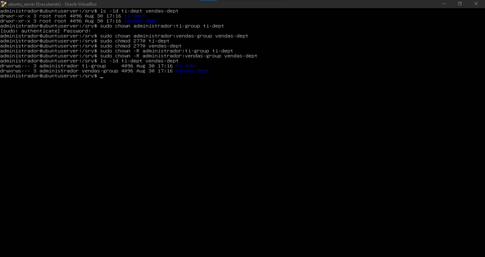
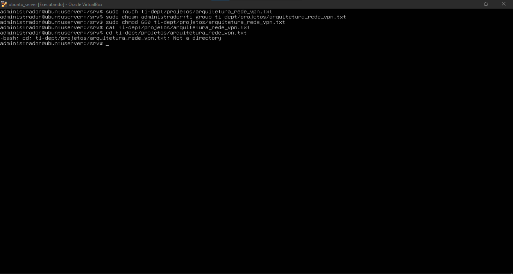
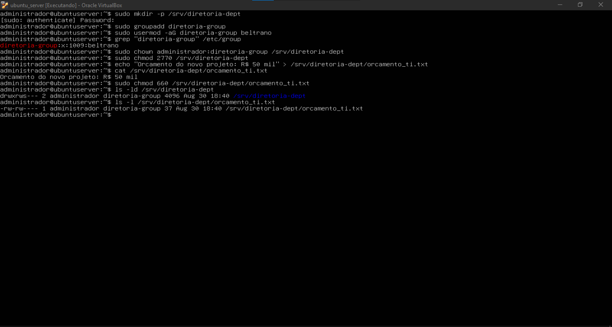
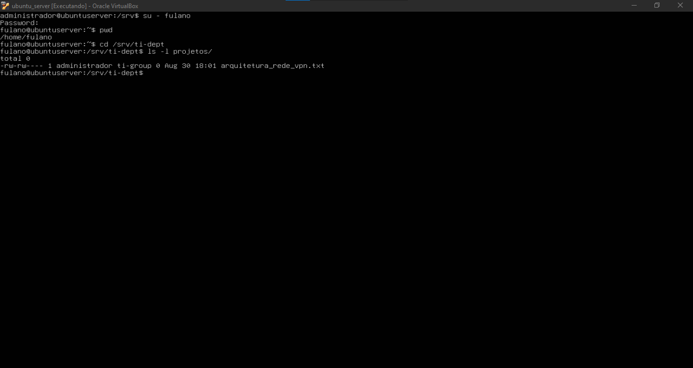
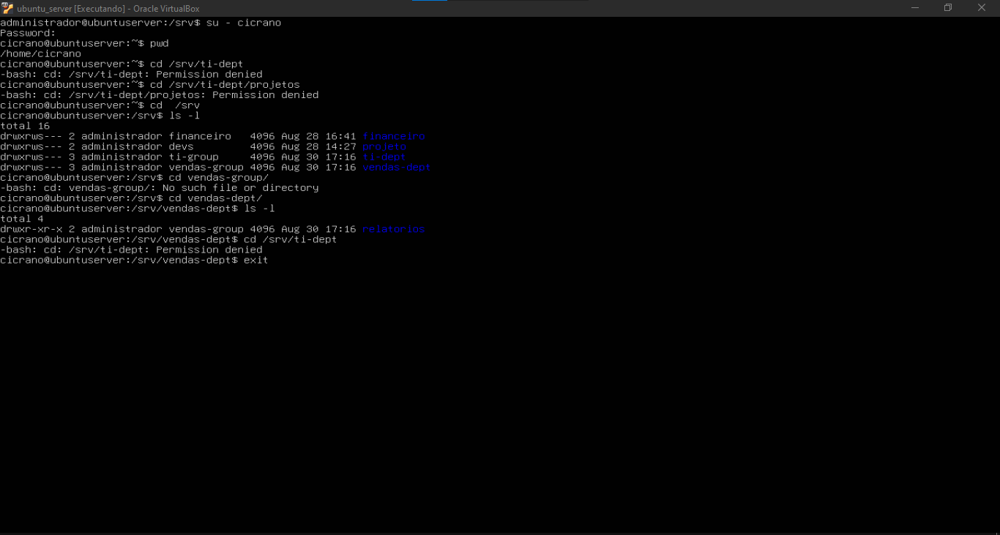
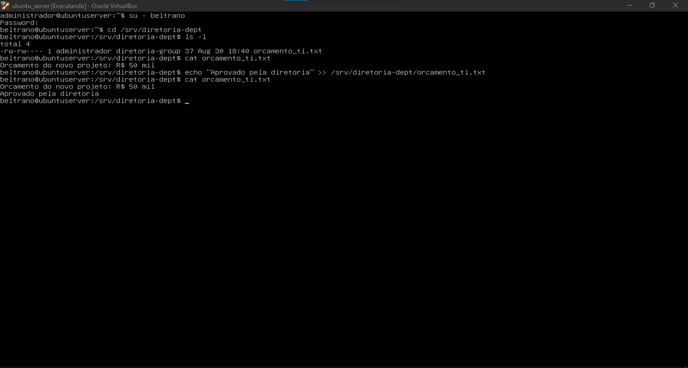
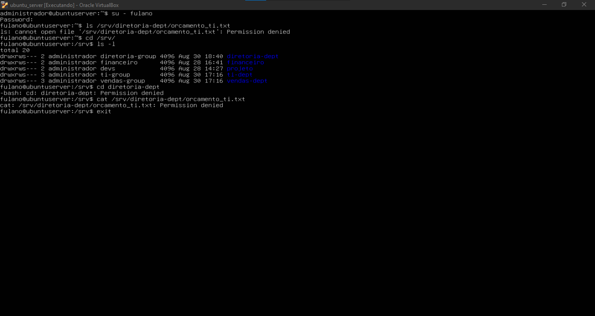

# Relatório Técnico: Estrutura de Diretórios, FHS e Permissões Avançadas no Linux Server

## 1. Identificação

- **Nome completo:** Mateus Alves dos Santos
- **Matrícula:** 2023002055
- **Curso:** Sistemas de Informação
- **Turma:** 2026.2
- **Data:** 19/08/2026
- **Título da prática:** Aula Prática 03: Estrutura de Diretórios, Pastas do Sistema (FHS) e Permissões Avançadas no Linux Server

---

## 2. Objetivo

A atividade teve como objetivo compreender a organização do sistema de arquivos Linux conforme o **Filesystem Hierarchy Standard (FHS)** e aplicar conceitos de propriedade, grupos e permissões em uma estrutura de diretórios voltada para diferentes setores de uma organização.

A prática envolveu a inspeção de diretórios e arquivos do sistema, análise de registros de autenticação, criação de estruturas departamentais em `/srv`, criação de grupos específicos, associação de usuários, definição de propriedade e permissões, criação de arquivos compartilhados e testes de acesso com usuários autorizados e não autorizados.

Além do procedimento apresentado no roteiro, foram aplicados alguns ajustes adicionais durante a execução. Em especial, os diretórios departamentais foram configurados com **SetGID por meio da permissão `2770`**, em vez de apenas `770`. Também foram realizados testes complementares para verificar não apenas o bloqueio entre departamentos, mas também o acesso correto do usuário ao seu próprio setor.

---

## 3. Ambiente

A atividade foi executada na máquina virtual Ubuntu Server preparada nas aulas anteriores, utilizando:

- **Sistema operacional:** Ubuntu Server;
- **Virtualizador:** Oracle VM VirtualBox;
- **Usuário administrativo:** `administrador`;
- **Usuários utilizados nos testes:** `fulano`, `cicrano` e `beltrano`;
- **Grupos criados:** `ti-group`, `vendas-group` e `diretoria-group`;
- **Diretórios departamentais:** `/srv/ti-dept`, `/srv/vendas-dept` e `/srv/diretoria-dept`.

Os diretórios `/srv/projeto` e `/srv/financeiro`, configurados na atividade anterior, já estavam presentes no sistema e aparecem em algumas das evidências desta prática.

---

## 4. Procedimento

### 4.1. Exploração da estrutura do sistema de arquivos

Inicialmente foi acessado o diretório `/etc`:

```bash
cd /etc
```

Em seguida, foram listados os primeiros itens do diretório com:

```bash
ls -F | head -n 15
```

O parâmetro `-F` adiciona indicadores aos nomes apresentados, facilitando a identificação de diretórios e outros tipos de entrada.

O diretório atual foi confirmado com:

```bash
pwd
```

A saída apresentou:

```text
/etc
```

Também foram consultadas as últimas linhas do arquivo de log de autenticação:

```bash
sudo tail -n 10 /var/log/auth.log
```

Esse arquivo registra eventos relacionados a autenticação, abertura de sessões, utilização de `sudo` e outros eventos de segurança do sistema.


---

### 4.2. Criação da estrutura departamental em `/srv`

O diretório `/srv` foi utilizado para armazenar as estruturas destinadas aos setores da organização.

Foram criados os diretórios:

```bash
sudo mkdir -p ti-dept/projetos vendas-dept/relatorios
```

A estrutura criada foi conferida com:

```bash
ls -r
ls -R
```

O comando `ls -R` permitiu visualizar recursivamente os diretórios:

```text
/srv/ti-dept/projetos
/srv/vendas-dept/relatorios
```

Na mesma listagem também aparecem `/srv/projeto` e `/srv/financeiro`, que já existiam em decorrência da Aula 02.

---

### 4.3. Criação dos grupos departamentais

Foram criados os grupos responsáveis pelo controle de acesso aos respectivos setores:

```bash
sudo groupadd ti-group
sudo groupadd vendas-group
```

Em seguida, os usuários foram associados aos grupos:

```bash
sudo usermod -aG ti-group fulano
sudo usermod -aG vendas-group cicrano
```

Além do procedimento previsto, a associação foi explicitamente validada consultando `/etc/group`:

```bash
grep "ti-group" /etc/group
grep "vendas-group" /etc/group
```

As saídas confirmaram:

```text
ti-group:x:1007:fulano
vendas-group:x:1008:cicrano
```


---

### 4.4. Configuração de propriedade e permissões dos departamentos

Inicialmente, os diretórios recém-criados pertenciam a `root:root`.

Foram então atribuídos ao usuário `administrador` e aos grupos de seus respectivos setores:

```bash
sudo chown administrador:ti-group ti-dept
sudo chown administrador:vendas-group vendas-dept
```

#### Ajuste realizado em relação ao roteiro

Em vez da permissão `770` apresentada no roteiro, os dois diretórios foram configurados com:

```bash
sudo chmod 2770 ti-dept
sudo chmod 2770 vendas-dept
```

A permissão `2770` mantém:

- `rwx` para o proprietário;
- `rwx` para o grupo;
- nenhuma permissão para outros usuários;

e acrescenta o bit especial **SetGID** por meio do primeiro algarismo `2`.

Com SetGID ativo em um diretório, novos arquivos e subdiretórios criados dentro dele herdam o grupo do diretório pai. Dessa forma, recursos criados em `ti-dept` tendem a permanecer associados a `ti-group`, enquanto os criados em `vendas-dept` permanecem associados a `vendas-group`.

Também foi realizada a aplicação recursiva da propriedade e do grupo em **ambos os departamentos**:

```bash
sudo chown -R administrador:ti-group ti-dept
sudo chown -R administrador:vendas-group vendas-dept
```

Essa foi outra ampliação em relação ao procedimento-base, garantindo que as estruturas internas já existentes ficassem associadas aos grupos corretos.

A configuração final foi verificada com:

```bash
ls -ld ti-dept vendas-dept
```

O `s` apresentado na posição de execução do grupo, como em `drwxrws---`, confirma que o SetGID estava ativo.



---

### 4.5. Criação do arquivo do setor de TI

Dentro do diretório de projetos do setor de TI foi criado o arquivo:

```bash
sudo touch ti-dept/projetos/arquitetura_rede_vpn.txt
```

O proprietário e o grupo foram configurados com:

```bash
sudo chown administrador:ti-group ti-dept/projetos/arquitetura_rede_vpn.txt
```

Em seguida foram aplicadas as permissões:

```bash
sudo chmod 660 ti-dept/projetos/arquitetura_rede_vpn.txt
```

A permissão `660` concede leitura e escrita ao proprietário e ao grupo e não concede permissões aos demais usuários.

Também foi executado:

```bash
cat ti-dept/projetos/arquitetura_rede_vpn.txt
```

Como o arquivo havia acabado de ser criado com `touch`, ele ainda estava vazio naquele momento.



---

### 4.6. Desafio: criação do diretório da diretoria

No desafio proposto, foi criado:

```bash
sudo mkdir -p /srv/diretoria-dept
```

Em seguida, foi criado o grupo:

```bash
sudo groupadd diretoria-group
```

e o usuário `beltrano` foi associado a ele:

```bash
sudo usermod -aG diretoria-group beltrano
```

A associação foi validada por meio de:

```bash
grep "diretoria-group" /etc/group
```

O diretório foi configurado com:

```bash
sudo chown administrador:diretoria-group /srv/diretoria-dept
```

#### Ajuste realizado em relação ao desafio original

Também nesse diretório foi adotado **SetGID**, utilizando:

```bash
sudo chmod 2770 /srv/diretoria-dept
```

Em vez de apenas `770`, o valor `2770` mantém o mesmo controle de acesso e acrescenta a herança do grupo `diretoria-group` para novos recursos criados no diretório.

Foi criado o arquivo `orcamento_ti.txt` já contendo uma informação inicial:

```bash
echo "Orcamento do novo projeto: R$ 50 mil" > /srv/diretoria-dept/orcamento_ti.txt
```

Em seguida foram aplicadas as permissões:

```bash
sudo chmod 660 /srv/diretoria-dept/orcamento_ti.txt
```

A configuração final foi validada com:

```bash
ls -ld /srv/diretoria-dept
ls -l /srv/diretoria-dept/orcamento_ti.txt
```

A evidência mostra o diretório com SetGID ativo e o arquivo com leitura e escrita para proprietário e grupo.



---

## 5. Testes e Validação

### 5.1. Acesso autorizado do usuário `fulano` ao setor de TI

Foi iniciada uma sessão limpa com:

```bash
su - fulano
```

O comando:

```bash
pwd
```

confirmou que a sessão foi iniciada em:

```text
/home/fulano
```

Como `fulano` pertence ao grupo `ti-group`, ele conseguiu acessar:

```bash
cd /srv/ti-dept
```

e listar o conteúdo do diretório de projetos:

```bash
ls -l projetos/
```

O arquivo `arquitetura_rede_vpn.txt` foi listado com o grupo `ti-group`, demonstrando que o usuário autorizado conseguia acessar a estrutura do seu setor.



---

### 5.2. Bloqueio de `cicrano` no setor de TI e acesso permitido ao setor de Vendas

Foi iniciada uma sessão com:

```bash
su - cicrano
```

Como `cicrano` pertence a `vendas-group` e não a `ti-group`, as tentativas de acessar:

```bash
cd /srv/ti-dept
cd /srv/ti-dept/projetos
```

retornaram:

```text
Permission denied
```

#### Teste adicional realizado

Além do teste de bloqueio previsto, foi verificado se `cicrano` conseguia acessar corretamente o setor ao qual pertence.

Após retornar a `/srv`, foi executado:

```bash
cd vendas-dept/
ls -l
```

O acesso foi permitido e o subdiretório `relatorios` foi listado normalmente.

Em seguida, uma nova tentativa de acessar `/srv/ti-dept` a partir do setor de Vendas foi novamente bloqueada.

Esse teste adicional demonstrou simultaneamente os dois comportamentos esperados:

- acesso permitido ao departamento correspondente ao grupo do usuário;
- isolamento em relação ao departamento de outro grupo.



---

### 5.3. Acesso autorizado de `beltrano` ao diretório da diretoria

Foi iniciada uma sessão com:

```bash
su - beltrano
```

Como `beltrano` pertence ao grupo `diretoria-group`, o acesso ao diretório foi permitido:

```bash
cd /srv/diretoria-dept
ls -l
```

O conteúdo inicial de `orcamento_ti.txt` foi consultado:

```bash
cat orcamento_ti.txt
```

Posteriormente, o usuário acrescentou uma nova informação:

```bash
echo "Aprovado pela diretoria" >> /srv/diretoria-dept/orcamento_ti.txt
```

A leitura final:

```bash
cat orcamento_ti.txt
```

apresentou tanto o orçamento original quanto a linha adicionada por `beltrano`, comprovando que o membro do grupo possuía acesso de leitura e escrita.



---

### 5.4. Bloqueio de `fulano` no diretório da diretoria

Para validar a restrição de acesso foi iniciada uma sessão com:

```bash
su - fulano
```

Como `fulano` pertence ao grupo `ti-group`, mas não a `diretoria-group`, foram realizadas diferentes tentativas de acesso.

A tentativa de listar diretamente o arquivo:

```bash
ls /srv/diretoria-dept/orcamento_ti.txt
```

foi negada.

Também foi realizado:

```bash
cd /srv
ls -l
```

A listagem permitiu visualizar a existência dos diretórios departamentais, porém ao tentar entrar em:

```bash
cd diretoria-dept
```

o sistema retornou:

```text
Permission denied
```

Por fim, a tentativa de ler diretamente o arquivo:

```bash
cat /srv/diretoria-dept/orcamento_ti.txt
```

também foi bloqueada.

Esses testes demonstraram que conhecer o caminho ou visualizar o nome do diretório em `/srv` não concede acesso ao seu conteúdo quando as permissões do diretório impedem a travessia.



---

## 6. Problemas, Ajustes e Soluções

### 6.1. Tentativa de utilizar `cd` em um arquivo

Após a criação de `arquitetura_rede_vpn.txt`, foi executado:

```bash
cd ti-dept/projetos/arquitetura_rede_vpn.txt
```

O sistema retornou:

```text
-bash: cd: ti-dept/projetos/arquitetura_rede_vpn.txt: Not a directory
```

Isso ocorreu porque `cd` é utilizado para alterar o diretório de trabalho e, portanto, recebe como destino um **diretório**, não um arquivo regular.

Para consultar um arquivo de texto, podem ser utilizados comandos como:

```bash
cat arquivo.txt
less arquivo.txt
```

A ocorrência não afetou a configuração realizada e serviu para diferenciar a navegação por diretórios da leitura de arquivos.

---

### 6.2. Tentativa de acessar o nome do grupo como se fosse um diretório

Durante o teste com `cicrano`, foi executado inicialmente:

```bash
cd vendas-group/
```

O sistema retornou:

```text
No such file or directory
```

O nome `vendas-group` corresponde ao **grupo Linux**, e não ao diretório do setor.

O comando foi então corrigido para:

```bash
cd vendas-dept/
```

e o acesso ocorreu normalmente.

---

### 6.3. Uso de `2770` em vez de `770`

Uma alteração intencional em relação ao roteiro foi a aplicação:

```bash
chmod 2770
```

nos diretórios `ti-dept`, `vendas-dept` e `diretoria-dept`.

O roteiro utilizava permissões convencionais com `770`, suficientes para conceder `rwx` ao proprietário e ao grupo e bloquear outros usuários.

A adição do primeiro algarismo `2` ativa o **SetGID**. Assim, além do controle de acesso fornecido pelo `770`, novos arquivos e subdiretórios passam a herdar o grupo do diretório pai.

A alteração foi adotada para tornar os diretórios departamentais mais adequados ao compartilhamento entre integrantes de um mesmo setor.

É importante observar que o SetGID garante a **herança do grupo**, mas as permissões de leitura e escrita de um novo arquivo ainda podem ser influenciadas pela `umask` e pelo modo utilizado na criação do arquivo.

---

### 6.4. Aplicação recursiva de propriedade aos dois departamentos

Também foi realizada:

```bash
sudo chown -R administrador:ti-group ti-dept
sudo chown -R administrador:vendas-group vendas-dept
```

Dessa forma, não apenas os diretórios principais, mas também suas estruturas internas ficaram associados ao proprietário e ao grupo correspondentes.

Essa configuração complementou o procedimento-base e tornou explícita a padronização da propriedade dentro dos dois departamentos.

---

## 7. Conclusão

A atividade permitiu compreender a organização hierárquica do sistema de arquivos Linux e aplicar mecanismos de controle de acesso em uma estrutura que simula diferentes departamentos de uma organização.

A exploração de `/etc` e `/var/log/auth.log` demonstrou a finalidade de diretórios importantes definidos pelo FHS, enquanto a utilização de `/srv` permitiu organizar dados relacionados a serviços e setores específicos.

Os grupos `ti-group`, `vendas-group` e `diretoria-group` foram utilizados para separar o acesso entre os usuários. Os testes confirmaram que `fulano` conseguia acessar o setor de TI, `cicrano` conseguia acessar o setor de Vendas e `beltrano` conseguia ler e modificar o arquivo reservado à diretoria. Ao mesmo tempo, tentativas de acesso a setores não autorizados foram corretamente bloqueadas com **Permission denied**.

Em relação ao procedimento apresentado no roteiro, a principal alteração foi a utilização da permissão `2770` nos diretórios departamentais. O SetGID acrescentou a herança automática do grupo aos novos recursos criados nesses diretórios, tornando a configuração mais adequada a ambientes colaborativos. Também foi aplicada recursivamente a propriedade dos dois departamentos e foram realizados testes adicionais de acesso permitido e negado.

Os pequenos erros de navegação observados durante a execução — a tentativa de utilizar `cd` sobre um arquivo e a tentativa de acessar o nome de um grupo como se fosse um diretório — foram identificados e corrigidos durante a própria prática, contribuindo para reforçar a diferença entre usuários, grupos, arquivos e diretórios no Linux.

Dessa forma, a atividade consolidou os conceitos de FHS, propriedade, grupos, permissões tradicionais e bits especiais, além de demonstrar na prática como esses mecanismos podem ser combinados para criar ambientes compartilhados com isolamento entre setores.
