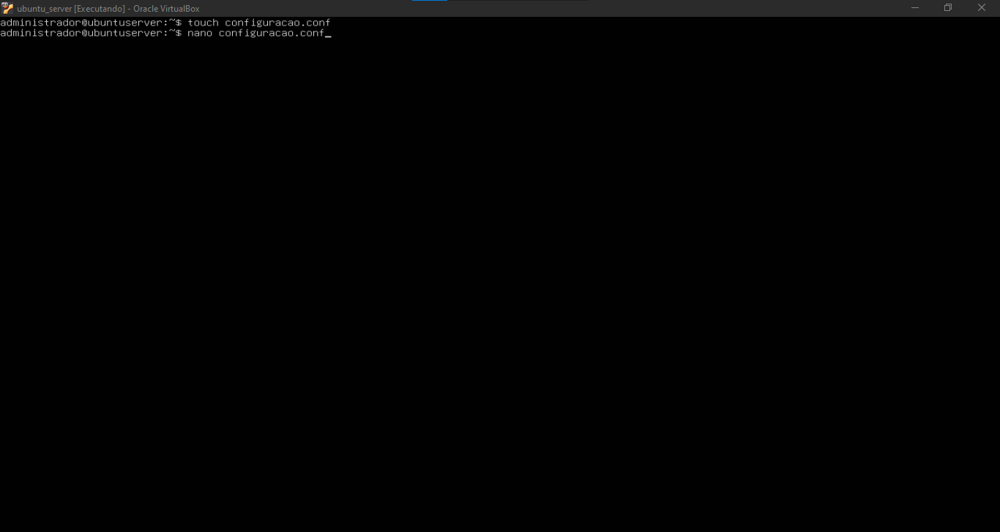
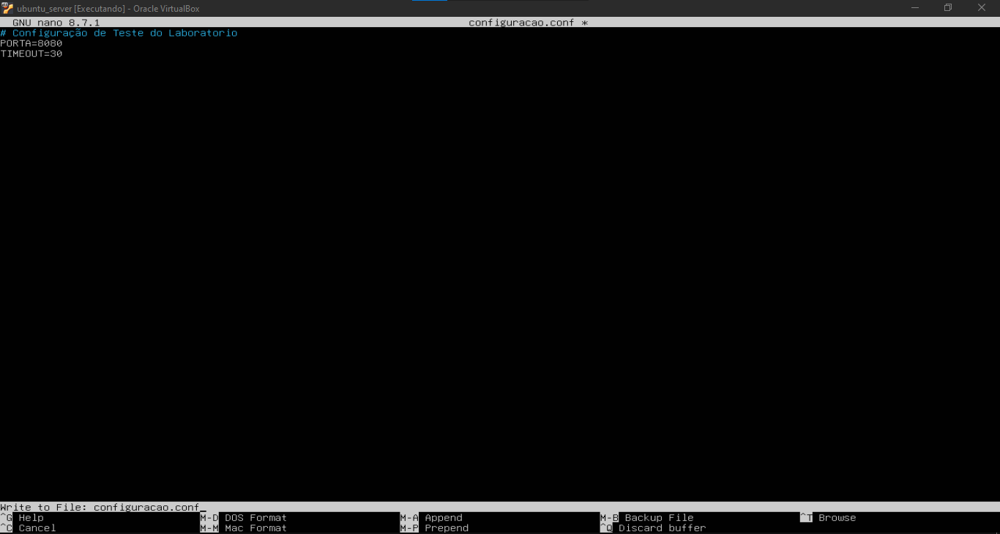
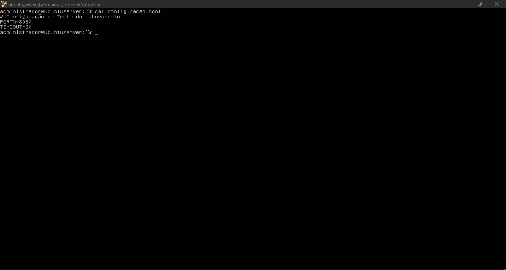
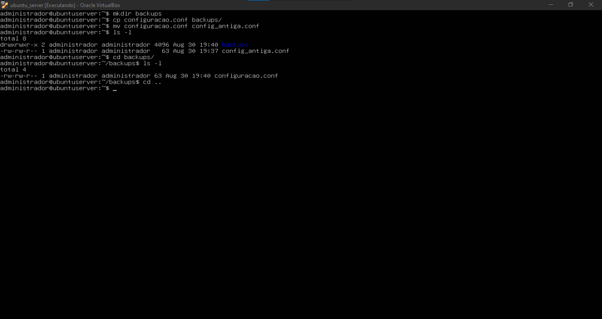
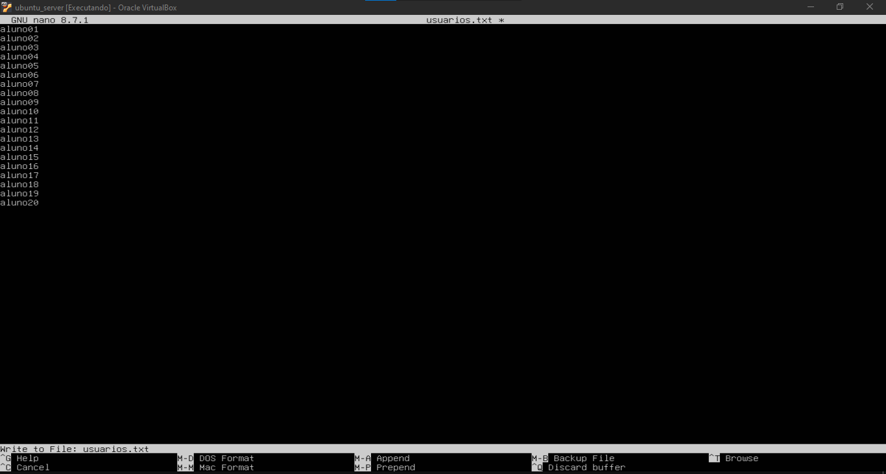
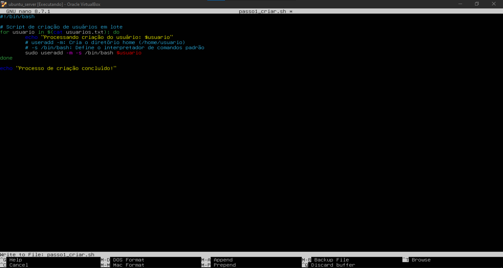
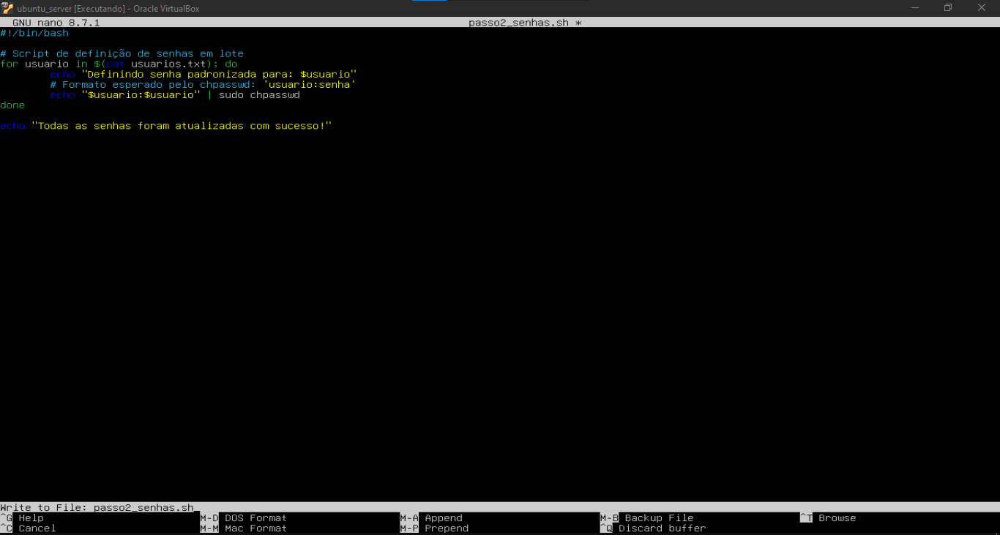
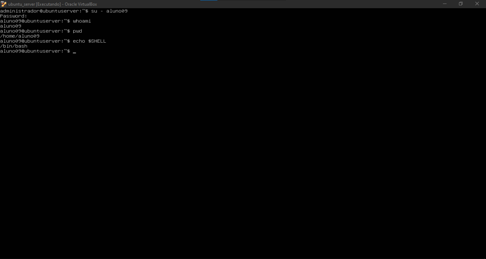
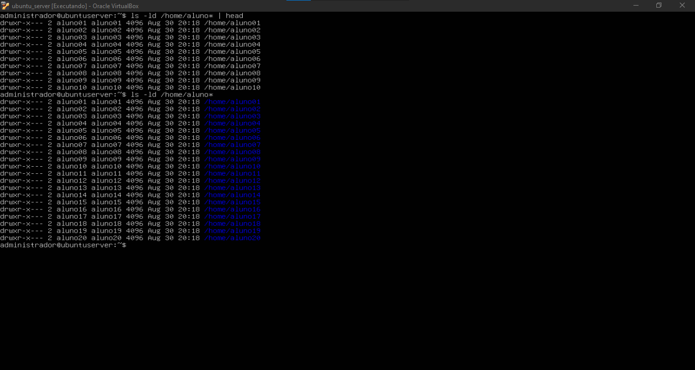

# Relatório Técnico: Manipulação, Edição, Permissões e Automação de Arquivos no Linux

## 1. Identificação

- **Nome completo:** Mateus Alves dos Santos
- **Matrícula:** 2023002055
- **Curso:** Sistemas de Informação
- **Turma:** 2026.2
- **Data:** 26/08/2026
- **Título da prática:** Aula Prática 04: Manipulação, Edição, Permissões e Automação de Arquivos no Linux

---

## 2. Objetivo

A atividade teve como objetivo praticar a criação, edição, cópia, movimentação e remoção de arquivos e diretórios no Ubuntu Server, além de introduzir conceitos de automação de tarefas administrativas por meio de Shell Script.

A prática também envolveu a criação automatizada de vinte contas de usuários, a definição de senhas em lote, a concessão de permissão de execução aos scripts e a validação das contas e grupos criados.

Além das validações previstas no roteiro, foi realizada uma verificação adicional dos diretórios pessoais criados em `/home`, permitindo comprovar diretamente o efeito da opção `-m` utilizada no comando `useradd`.

---

## 3. Ambiente

A atividade foi realizada na mesma máquina virtual utilizada nas aulas anteriores.

O ambiente utilizado foi:

- **Sistema operacional:** Ubuntu Server 26.04;
- **Virtualizador:** Oracle VM VirtualBox;
- **Usuário administrativo:** `administrador`;
- **Processador virtual:** 1 vCPU;
- **Memória RAM:** 2048 MB;
- **Disco virtual:** 32 GB;
- **Shell utilizado nos usuários criados:** `/bin/bash`.

Embora o roteiro da atividade cite uma máquina virtual com 512 MB de memória RAM, a VM utilizada permaneceu com **2048 MB**, pois nas atividades anteriores foi necessário aumentar a memória para permitir o funcionamento adequado do Ubuntu Server.

---

## 4. Procedimento

### 4.1. Criação e edição do arquivo `configuracao.conf`

Inicialmente foi criado um arquivo vazio com:

```bash
touch configuracao.conf
```

O arquivo foi aberto no editor Nano:

```bash
nano configuracao.conf
```

Nele foram inseridas as seguintes linhas:

```text
# Configuração de Teste do Laboratório
PORTA=8080
TIMEOUT=30
```

A edição foi realizada diretamente pelo terminal.





Após salvar o arquivo, seu conteúdo foi conferido com:

```bash
cat configuracao.conf
```

A saída confirmou que os parâmetros haviam sido gravados corretamente.



---

### 4.2. Cópia e movimentação de arquivos

Foi criado o diretório:

```bash
mkdir backups
```

O arquivo `configuracao.conf` foi copiado para dentro dele:

```bash
cp configuracao.conf backups/
```

Em seguida, o arquivo original foi renomeado:

```bash
mv configuracao.conf config_antiga.conf
```

Além dos comandos previstos no roteiro, foram utilizados comandos de listagem para validar as operações:

```bash
ls -l
cd backups/
ls -l
cd ..
```

A primeira listagem demonstrou a existência de `config_antiga.conf` e do diretório `backups`. Já a listagem interna de `backups` confirmou que a cópia original `configuracao.conf` havia sido preservada.



---

### 4.3. Remoção interativa e remoção recursiva

Inicialmente foi realizada a remoção interativa do arquivo renomeado:

```bash
rm -i config_antiga.conf
```

O parâmetro `-i` fez com que o sistema solicitasse confirmação antes da remoção:

```text
rm: remove regular file 'config_antiga.conf'? y
```

Após confirmar com `y`, foi utilizado:

```bash
ls -l
```

para verificar que o arquivo havia sido removido.

Posteriormente, o diretório de backup foi removido com:

```bash
rm -rf backups
```

Nesse comando:

- `-r` realiza a remoção recursiva do diretório e de seu conteúdo;
- `-f` força a operação sem solicitar confirmação.

Uma nova execução de `ls -l` confirmou que o diretório também havia sido removido.


---

### 4.4. Criação da lista de usuários

Foi criado o arquivo:

```bash
nano usuarios.txt
```

O arquivo recebeu vinte nomes de usuários, de `aluno01` até `aluno20`, um por linha.

Essa lista seria posteriormente utilizada como entrada para os dois scripts de automação.



---

### 4.5. Criação do script de cadastro de usuários

Foi criado:

```bash
nano passo1_criar.sh
```

O script utilizado foi:

```bash
#!/bin/bash

# Script de criação de usuários em lote
for usuario in $(cat usuarios.txt); do
    echo "Processando criação do usuário: $usuario"
    # useradd -m: Cria o diretório home (/home/usuario)
    # -s /bin/bash: Define o interpretador de comandos padrão
    sudo useradd -m -s /bin/bash $usuario
done

echo "Processo de criação concluído!"
```

O laço:

```bash
for usuario in $(cat usuarios.txt)
```

lê os nomes presentes em `usuarios.txt` e atribui cada um deles temporariamente à variável `$usuario`.

Para cada entrada, o comando:

```bash
sudo useradd -m -s /bin/bash $usuario
```

cria a conta correspondente.

As opções utilizadas possuem as seguintes funções:

- `-m`: cria automaticamente o diretório pessoal em `/home`;
- `-s /bin/bash`: define o Bash como shell padrão do novo usuário.



---

### 4.6. Criação do script de definição de senhas

Em seguida foi criado:

```bash
nano passo2_senhas.sh
```

O script utilizado foi:

```bash
#!/bin/bash

# Script de definição de senhas em lote
for usuario in $(cat usuarios.txt); do
    echo "Definindo senha padronizada para: $usuario"
    # Formato esperado pelo chpasswd: 'usuario:senha'
    echo "$usuario:$usuario" | sudo chpasswd
done

echo "Todas as senhas foram atualizadas com sucesso!"
```

Novamente foi utilizado um laço `for` para percorrer a lista de usuários.

O trecho:

```bash
echo "$usuario:$usuario" | sudo chpasswd
```

envia ao comando `chpasswd` um par no formato:

```text
usuario:senha
```

Conforme definido pela atividade, a senha de laboratório de cada conta foi configurada com o mesmo texto do nome do usuário.

Essa configuração foi utilizada exclusivamente para fins didáticos. Em um ambiente real, senhas iguais aos nomes das contas seriam inadequadas do ponto de vista de segurança.



---

### 4.7. Concessão de permissão de execução

Por padrão, os arquivos criados não possuíam permissão para serem executados diretamente.

Foi utilizada a forma simbólica do `chmod`:

```bash
chmod +x passo1_criar.sh
chmod +x passo2_senhas.sh
```

O parâmetro `+x` adiciona a permissão de execução aos arquivos.

---

## 5. Testes e Evidências

### 5.1. Execução do script de criação

O primeiro script foi executado com:

```bash
./passo1_criar.sh
```

Na primeira utilização de `sudo` durante a execução, foi solicitada a senha do usuário administrativo.

Após a autenticação, o script processou sequencialmente os usuários de `aluno01` a `aluno20`.

A mensagem:

```text
Processo de criação concluído!
```

indicou o término do processamento.

---

### 5.2. Execução do script de senhas

Em seguida foi executado:

```bash
./passo2_senhas.sh
```

O script percorreu novamente os vinte usuários e aplicou a senha definida para cada conta.

Ao final foi exibida:

```text
Todas as senhas foram atualizadas com sucesso!
```

A mesma evidência registra a concessão das permissões de execução e a execução completa dos dois scripts.


---

### 5.3. Validação das contas com `getent passwd`

Para verificar as contas criadas foi executado:

```bash
getent passwd | tail -n 20
```

O comando `getent passwd` consulta a base de dados de usuários disponibilizada pelo sistema. O filtro:

```bash
tail -n 20
```

limitou a saída às vinte últimas entradas.

A saída mostrou as contas de `aluno01` até `aluno20`, cada uma com seu diretório pessoal correspondente e com `/bin/bash` como shell.

---

### 5.4. Validação dos grupos com `getent group`

Também foi executado:

```bash
getent group | tail -n 20
```

A saída demonstrou a existência dos grupos correspondentes às contas criadas.

Isso ocorre porque, no ambiente utilizado, o `useradd` criou um grupo individual associado a cada novo usuário.


---

### 5.5. Teste de login com `aluno09`

O roteiro utiliza `aluno01` apenas como exemplo para o teste de login. Durante a execução da atividade foi escolhido o usuário **`aluno09`**.

Foi executado:

```bash
su - aluno09
```

Após informar a senha definida pelo script, o prompt mudou para a nova conta.

Foram realizados os testes:

```bash
whoami
pwd
echo $SHELL
```

As saídas confirmaram:

```text
aluno09
/home/aluno09
/bin/bash
```

Portanto, o teste demonstrou simultaneamente que:

- a conta havia sido criada;
- a senha configurada pelo segundo script funcionava;
- o diretório pessoal `/home/aluno09` existia;
- o shell padrão era `/bin/bash`.

Essa validação comprova diretamente o funcionamento das opções `-m` e `-s /bin/bash` utilizadas no script de criação.

> Embora o nome do arquivo da evidência tenha sido inicialmente definido como `13-login-aluno01.png`, o usuário efetivamente utilizado no teste foi `aluno09`.



---

### 5.6. Validação adicional dos diretórios pessoais

Além dos testes exigidos no roteiro, foi realizada uma verificação específica dos diretórios pessoais criados pelo script.

Inicialmente foi executado:

```bash
ls -ld /home/aluno* | head
```

para visualizar uma parte da listagem.

Em seguida foi realizada a listagem completa:

```bash
ls -ld /home/aluno*
```

A saída mostrou os diretórios:

```text
/home/aluno01
/home/aluno02
...
/home/aluno20
```

Cada diretório apareceu associado ao respectivo usuário e grupo.

Esse teste adicional permitiu comprovar que a opção:

```bash
useradd -m
```

realmente criou os diretórios pessoais das vinte contas.



---

## 6. Problemas, Ajustes e Soluções

### 6.1. Adequação da memória da máquina virtual

O roteiro da Aula 04 apresenta como referência uma máquina virtual com 512 MB de memória RAM.

Entretanto, o ambiente utilizado nesta prática permaneceu configurado com **2048 MB**, pois durante a Aula 01 a quantidade de 512 MB provocou erro de memória durante a inicialização do Ubuntu Server.

Por esse motivo, não foi reduzida a memória para o valor original do roteiro. A configuração de 2048 MB foi mantida para garantir a estabilidade do ambiente.

---

### 6.2. Teste de login realizado com usuário diferente do exemplo

O roteiro apresenta `su - aluno01` apenas como exemplo de validação de uma das contas criadas.

Nesta execução foi escolhido:

```bash
su - aluno09
```

A alteração não modifica o objetivo do teste, uma vez que todas as vinte contas foram criadas pelo mesmo processo automatizado.

Os comandos `whoami`, `pwd` e `echo $SHELL` foram utilizados como verificações adicionais para demonstrar com maior clareza que a sessão havia sido iniciada corretamente.

---

### 6.3. Validação adicional dos diretórios `/home`

O roteiro exige a validação das contas por meio de `getent passwd`, dos grupos por `getent group` e de um login bem-sucedido.

Além desses procedimentos, foi utilizado:

```bash
ls -ld /home/aluno*
```

A verificação foi acrescentada para comprovar diretamente a criação dos diretórios pessoais e, consequentemente, o funcionamento da opção `-m` utilizada em:

```bash
useradd -m
```

---

### 6.4. Execução dos scripts

Não foram observados erros de sintaxe ou falhas durante a execução dos dois scripts.

A única interação necessária ocorreu quando `sudo` solicitou a senha do usuário `administrador` durante a primeira execução privilegiada. Após a autenticação, os vinte usuários foram criados e as senhas foram configuradas normalmente.

---

## 7. Conclusão

A atividade permitiu praticar operações fundamentais de manipulação de arquivos no Linux e introduziu a utilização de Shell Script para automatizar tarefas administrativas repetitivas.

Na primeira parte foram utilizados comandos como `touch`, `nano`, `cat`, `mkdir`, `cp`, `mv`, `rm -i` e `rm -rf`, permitindo compreender diferentes formas de criar, editar, copiar, mover e excluir arquivos e diretórios.

Na etapa de automação foram criados dois scripts. O primeiro utilizou `for`, `cat` e `useradd` para cadastrar vinte contas automaticamente, enquanto o segundo utilizou `chpasswd` para configurar as senhas em lote.

Os comandos `getent passwd` e `getent group` demonstraram que as contas e grupos foram integrados corretamente às bases de dados do sistema. O login realizado com `aluno09` confirmou o funcionamento da senha, do diretório pessoal e do shell `/bin/bash`.

Além das validações propostas no roteiro, a listagem de `/home/aluno*` comprovou diretamente que a opção `-m` do `useradd` criou os vinte diretórios pessoais.

A prática demonstrou a importância da automação na administração de sistemas. Embora a criação manual de poucos usuários seja possível, o uso de scripts reduz operações repetitivas e torna o gerenciamento de um número maior de contas mais rápido, padronizado e escalável.
